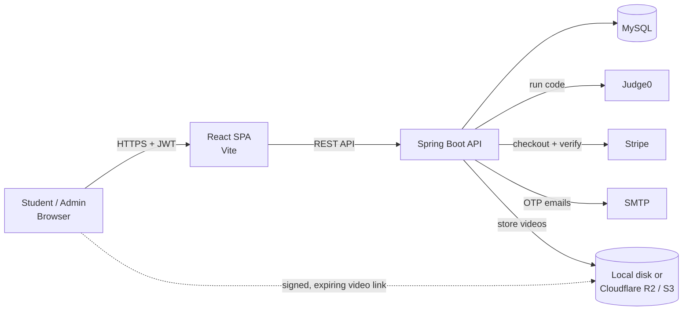

<div align="center">


### Learn. Code. Succeed.

A full-stack EdTech platform for coding education: video courses, an in-browser code judge,
MCQ assessments, guided roadmaps and verifiable certificates.


</div>

---

## Overview

LearnStream brings the full learning loop into one product. A student watches a lesson, practises
in a real code editor, passes the course assessment and downloads a certificate that anyone can verify.
Instructors manage every piece of content from a dedicated admin console.

It was designed to be hosted for real students, so everything sensitive stays on the server:
quiz answers, hidden test cases, paid video links and pricing are never exposed to the browser.

## Features

### For students
- **Video courses** with free preview lessons, per-lesson progress and a resume-where-you-left-off player
- **Coding practice** in Java, Python, C++ and JavaScript, with *Run* against examples and *Submit* against hidden tests
- **Earn while you learn**: every 5 problems solved unlocks any paid course for free
- **MCQ quizzes** graded on the server, with attempt limits and pass marks
- **Certificates** issued on completion, each with a unique ID and a public verification page
- **Roadmaps**: step-by-step career paths with progress tracking
- **Leaderboard** ranking students by problems solved and quiz performance
- **Secure checkout** through Stripe, plus OTP email verification and password reset

### For administrators
- Create and edit **courses and lessons**, using YouTube links or **uploaded video files**
- Author **MCQ quizzes** and attach them to courses as certification requirements
- Publish **coding problems** with sample and hidden test cases and starter code per language
- Build **roadmaps** linked to courses and external resources
- Manage **students**: search, grant course access, promote admins
- **Dashboard** with revenue, enrollments, certificates and a full leaderboard

## Architecture



| Layer | Technology |
|---|---|
| Frontend | React 19, React Router 7, Vite 7, CodeMirror 6, Axios |
| Backend | Spring Boot 4, Spring Security 7 (JWT), Spring Data JPA / Hibernate 7, Bean Validation |
| Database | MySQL 8 |
| Integrations | Judge0 (code execution), Stripe Checkout, SMTP, OpenPDF (certificates), AWS SDK v2 (R2 / S3) |

## Security by design

| Concern | How it's handled |
|---|---|
| Quiz answers | Graded on the server; students only ever receive their score |
| Hidden test cases | Inputs, outputs and error streams of hidden tests never leave the server |
| Paid content | Video links are issued only to enrolled students, as short-lived signed URLs |
| Payments | Price is read from the database; enrollment happens only after Stripe confirms the payment |
| Roles | Every sign-up is a student; the role is read from the database on each request, never trusted from the client |
| Accounts | BCrypt passwords, hashed OTPs with expiry and attempt limits, rate-limited auth endpoints, sessions revoked on password change |
| Secrets | Kept out of source control in `secrets.properties` or environment variables |

## Repository structure

```
learnstream/
├── LearnStream-Backend/        Spring Boot REST API
│   ├── src/main/java/com/learnsstream/
│   │   ├── config/             Security, startup data
│   │   ├── controller/         REST endpoints
│   │   ├── service/            Business logic
│   │   ├── entity/             JPA entities
│   │   ├── repository/         Data access
│   │   ├── dto/                Request / response models
│   │   └── security/           JWT, rate limiting
│   ├── Dockerfile
│   └── secrets.properties.example
├── learnstream_frontend/       React single-page app
│   ├── src/pages/              Student pages and admin console
│   ├── src/components/         Shared UI
│   └── src/styles/             Design system
```

## Getting started

### Prerequisites
- Java 17 or newer (21 recommended)
- Node.js 20 or newer
- MySQL 8

### 1. Backend

```bash
cd LearnStream-Backend
cp secrets.properties.example secrets.properties   # then fill in your values
./mvnw spring-boot:run                              # Windows: mvnw.cmd spring-boot:run
```

The API starts on `http://localhost:8080`. On first launch it creates the database, an admin account
from your settings and a set of sample courses, problems, quizzes and roadmaps.

> No email account yet? Set `learnstream.mail.enabled=false` and OTP codes are printed in the console.

### 2. Frontend

```bash
cd learnstream_frontend
npm install
npm run dev
```

Open `http://localhost:5173`.

## Configuration

All settings live in `LearnStream-Backend/src/main/resources/application.properties` and can be overridden
in `secrets.properties` or with environment variables.

| Variable | Purpose |
|---|---|
| `DB_URL`, `DB_USERNAME`, `DB_PASSWORD` | MySQL connection |
| `JWT_SECRET` | Token signing key (32+ characters) |
| `ADMIN_EMAIL`, `ADMIN_PASSWORD` | First admin account, created on startup |
| `MAIL_HOST`, `MAIL_PORT`, `MAIL_USERNAME`, `MAIL_PASSWORD` | SMTP for OTP emails |
| `STRIPE_SECRET_KEY`, `STRIPE_WEBHOOK_SECRET` | Payments |
| `JUDGE0_URL`, `JUDGE0_API_KEY` | Code execution service |
| `STORAGE_TYPE`, `S3_ENDPOINT`, `S3_BUCKET`, `S3_ACCESS_KEY`, `S3_SECRET_KEY` | Video storage (`local` or `s3`) |
| `FRONTEND_URL`, `BACKEND_URL`, `CORS_ORIGINS` | Public URLs |
| `VITE_API_URL` | Frontend: address of the API |

## Deployment

| Part | Suggested host |
|---|---|
| Frontend | Netlify, Vercel or Cloudflare Pages (static build from `learnstream_frontend`) |
| Backend | Any Docker host, e.g. Render (`Dockerfile` included, root directory `LearnStream-Backend`) |
| Database | Managed MySQL, e.g. Aiven |
| Videos | Cloudflare R2 or any S3-compatible bucket |

Set the environment variables above on your host, point `VITE_API_URL` at the deployed API,
and add the frontend URL to `CORS_ORIGINS`.

## Roadmap

- [ ] Razorpay / UPI payments
- [ ] Discussion threads on lessons and problems
- [ ] Timed contests
- [ ] Adaptive video streaming (HLS)

## License

All rights reserved. Contact the author for usage permissions.

<div align="center">
<br />
<sub>Built with care for learners.</sub>
</div>
